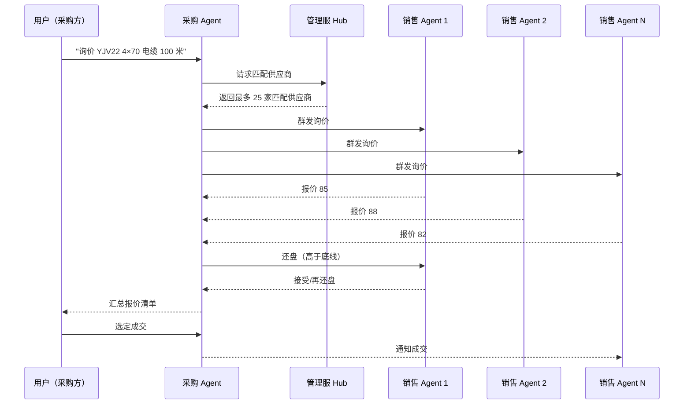

# ACSSA 架构

> 本文档说明 ACSSA 智能体操作系统的整体架构、模块职责、数据流。

---

## 一、定位

ACSSA 是面向企业生产环境的**多智能体操作系统**——提供 Agent 落地所需的完整基础设施，而非单 Agent 框架。

核心价值：让多个 Agent 能够**发现、通信、协作、进化**，并拥有**生产级**的运行时、安全审计、资源隔离。

---

## 二、模块架构

```
┌─────────────────────────────────────────────────────────────┐
│                        接入层                                 │
│   飞书 / 钉钉 / 企微 / 自研 IM / Web（经 OpenClaw 通道）       │
└──────────────────────────┬──────────────────────────────────┘
                           │
┌──────────────────────────▼──────────────────────────────────┐
│                     网关 gateway                              │
│   身份解析 · 角色检查 · 中间件编排 · 速率限制                   │
└──────────────────────────┬──────────────────────────────────┘
                           │
┌──────────────────────────▼──────────────────────────────────┐
│                  八核心模块                                    │
│                                                              │
│  吸星 xixing      知识进化（采集→质量门→蒸馏→注入→自评）       │
│  永恒 yongheng    记忆检索（embedding+语义搜索+画像+梦境门）   │
│  镇岳 zhenyue     安全审计（HMAC+哈希链+审批+隔离+应急）       │
│  寰宇 huanyu      通信目录（运行时+消息总线+国标+跨底座）       │
│  汇川 huichuan    文件中枢（飞书接收+Excel解析+MCP+搜索）      │
│  司库 siku        财务（账户+审计+chat）                      │
│  执策 zhice       任务编排（SOP分解+FSM状态机+多签验证）       │
│  羲和 xihe        Skill执行运行时（IPC+cgroups+信任分级）     │
│                                                              │
│  辅助层：common（共享底座）/ product / gateway / builtin       │
│  生态层：osskill（Skill框架+岗位智能体）                      │
└─────────────────────────────────────────────────────────────┘
```

---

## 三、模块职责

| 模块 | 目录 | 职责 |
|------|------|------|
| 吸星 xixing | `qingtian/xixing/` | 知识进化：采集 → 质量门 → 分类 → 蒸馏 → 永恒注入 → 自知自评 → 差距分析 → 提案 → 跨底座同步 |
| 永恒 yongheng | `qingtian/yongheng/` | 记忆检索：embedding + 语义搜索 + 记忆固化 + 画像 + 梦境门 |
| 镇岳 zhenyue | `qingtian/zhenyue/` | 安全审计：HMAC 签名 + 哈希链审计 + 审批 + 隔离 + 应急令牌 |
| 寰宇 huanyu | `qingtian/huanyu/` | 通信目录：Agent 运行时 + 消息总线 + 国标协议 + 跨底座 Pub/Sub |
| 汇川 huichuan | `qingtian/huichuan/` | 文件中枢：飞书接收 / Excel 解析 / MCP / 搜索 / refine |
| 司库 siku | `qingtian/siku/` | 财务：财务 Agent / 账户 / 审计 |
| 执策 zhice | `qingtian/zhice/` | 任务编排：SOP 动作分解与执行、FSM 状态机、多签验证 |
| 羲和 xihe | `qingtian/xihe/` | Skill 执行运行时：JSON-RPC IPC / cgroups / OOM 检测 / 信任分级 |

---

## 四、多 Agent 协作数据流

以"采购询价"为例：



---

## 五、生产级特性

| 特性 | 实现 | 模块 |
|------|------|------|
| 资源隔离 | Skill 独立子进程 + cgroups CPU 权重 + 内存上限 + OOM 检测 | 羲和 |
| 安全审计 | 哈希链日志不可篡改 + HMAC 签名 + 权限分级 | 镇岳 |
| 多底座 | 跨服务器联邦通信，管理/采购/销售三服协同 | 寰宇 |
| 数据主权 | 私有化部署，数据不出网络边界 | 底座 |
| 可观测 | 全链路 trace + 指标 + 告警 | 各模块 |

---

## 六、Skill 生态架构

```
岗位智能体 = 基础壳 + Skill 绑定 + 领域知识库

用户"写标书" → 工作秘书（统一入口）
  → 路由到投标助手 Skill
  → 投标 Skill 内部：解析 → 生成 → 评审 → 交付
```

- **通用 Skill**（开源）：文档/翻译/会议/Excel 等
- **商业 Skill**（闭源）：投标/采购/销售，走 acssa.cn 市场
